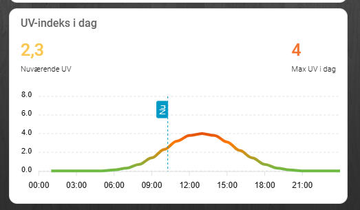

# Home Assistant DMI UV

Simple UV index setup using DMI's public API..



### This is not an official DMI integration.
It depends on an undocumented DMI endpoint and may break if DMI changes their API.

## Features

- Current UV index
- Daily max UV
- Hourly UV forecast graph
- DMI-style color thresholds
- Conditional display (only when relevant)

## Requirements

- Home Assistant
- ApexCharts Card
- card-mod optional, not required

## Installation

1. Copy `packages/dmi_uv.yaml` to `/config/packages/`
2. Enable packages in `configuration.yaml`:

```yaml
homeassistant:
  packages: !include_dir_named packages


### Created with help from ChatGPT and tested in Home Assistant.

## Features

- Current UV index
- Daily max UV
- Hourly UV forecast graph
- DMI-style color thresholds
- Conditional display (only when relevant)

